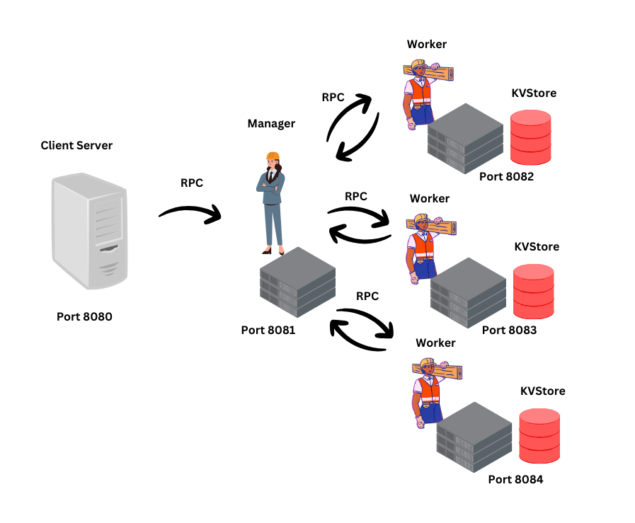

# Orchestration

Welcome to the orchestrator project, specified in TLAplus and coded in Golang.

## Video content

Please visit the Youtube channel where this project is recorded to learn more about TLA+, Go and the orchestrator pattern as used in Borg and Kubernetes. This project is a simplified version showing how easy it is to create distributed applications using TLA+ and Golang.

There exists a Client RPC Server that communicates with a Manager RPC Server, which in turn communicates with the Worker RPC Servers (3 in this case) that are required to register with the Manager to receive work. The Manager handles shutdown of the workers when work is complete and itself. The Workers handle cleaup of their own KVStore and data on each. See the image below for the architecture.

## Goals:

- Create Orchestrator Pattern - done
- Demonstrate Raft consensus between several managers - ongoing
- Demonstrate Lock Service for Manager communicating with several Clients - ongoing
- Demonstrate KVRaft algorithm for the Workers and their KVStore - ongoing

### Run integration test with cleanup

```
    go run main.go 8080 8081 8082 8083 8084

```

<h3 align="center" > </h3
